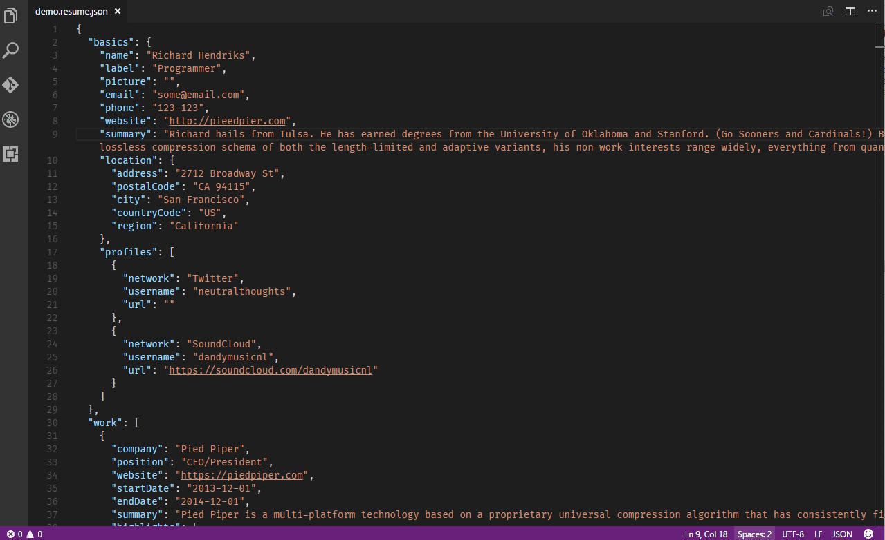
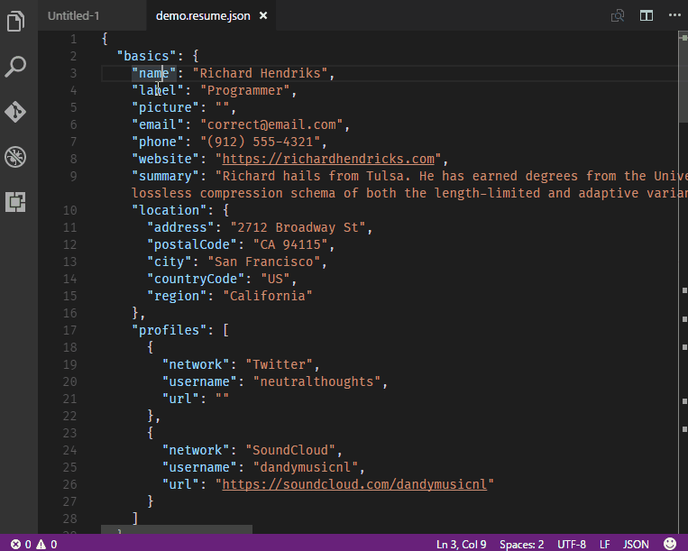
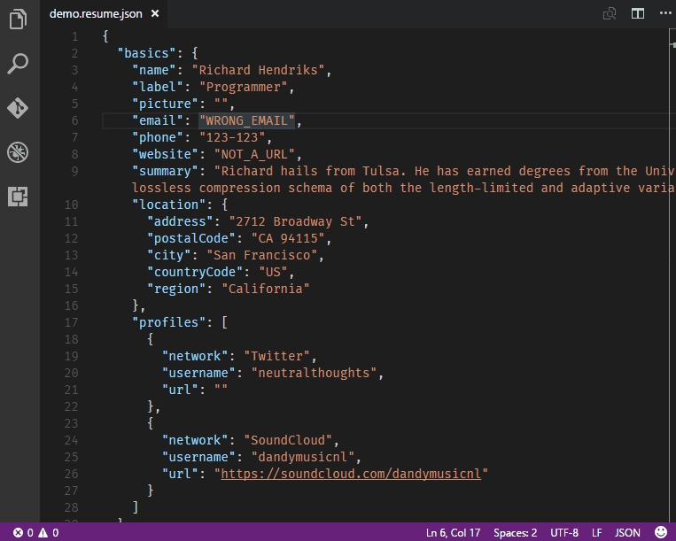
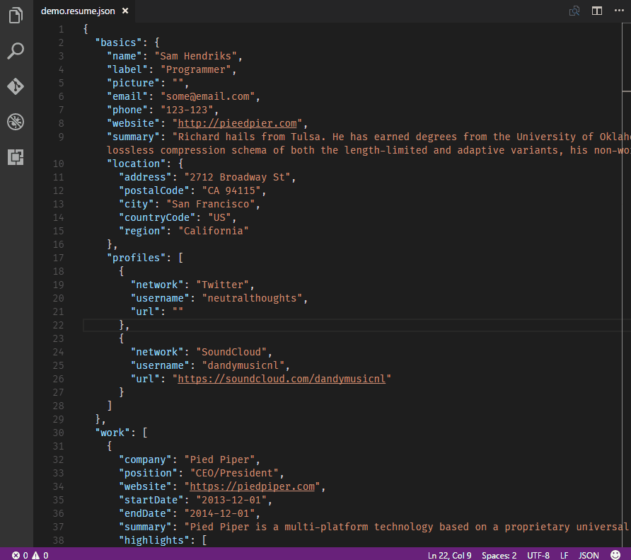
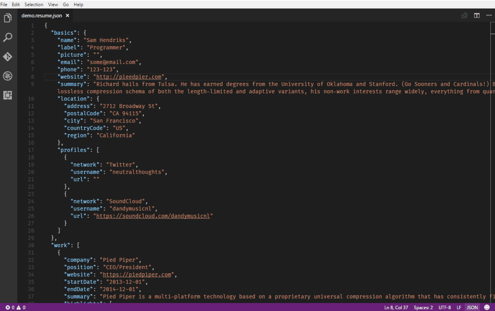

# JSONResume

This extension is a wrapper around a great tool called  [hackmyresume](http://please.hackmyresume.com/) that allows you to validate, analyze and convert your [JSONResume](https://jsonresume.org/) document.

## Features

The following features are available:

### Resume preview

### Schema hints and completion (jsonschema)
> Tip: For this mode to work, your files must be end with **.resume.json** . See [Known Issues](#issues)

### Schema validation (hackmyresume)

### Resume analysis (hackmyresume)

### PDF Generation

## Extension Settings
This extension contributes the following settings:

* `JSONResume.theme`: Theme to use. Either one of: 'positive', 'modern', 'compact', 'basis' or a path to json-resume theme (default: `modern`)
* `JSONResume.analysis`: Show resume analysis on each run (default: `true`) 
* `JSONResume.autoSave`: Save the resume before showing/updating the preview (default: `true`)
* `JSONResume.validation`: Validate the resume on each run (default: `true`)
* `JSONResume.openPDF`: Open the PDF file immidately after it's been generated (default: `false`)

This extension contributes the following key bindings:

* `ctrl-shift-j`: activate the JSONResume preview and validation

## Known Issues

1. To make sure that the schema validation works properly, your files must be end with **.resume.json** . 
2. External images don't seem render in the HTML preview. PDF Generation is not affected.
3. No tests :)

## Release Notes

### 0.0.2

- Fixed the package to be smaller (removed documentation images)
- Made an ugly icon

### 0.0.1
- Initial release

